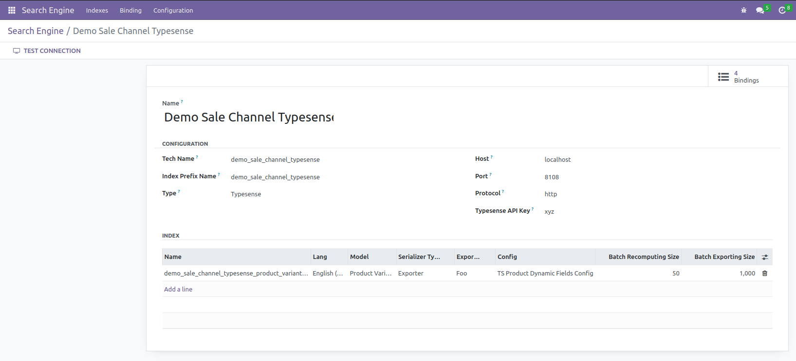
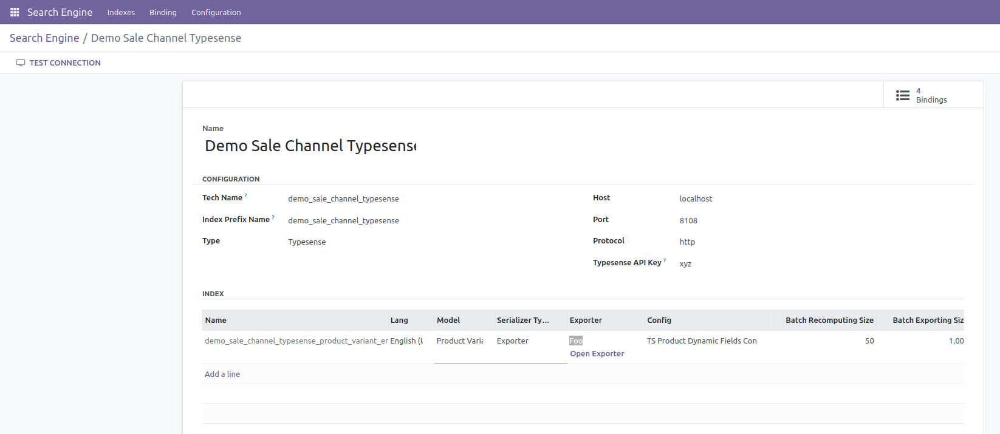
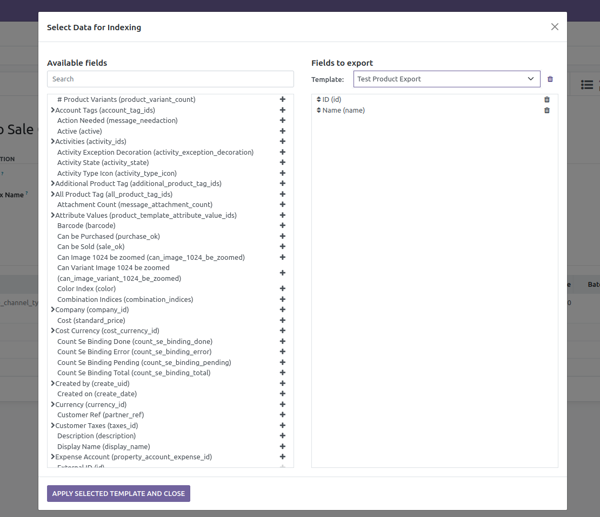

You need to have typesense search engine running and successfully connected to odoo.

Make sure to have `connector_search_engine` and `connector_typesense` modules installed.

## SE Index Config

Transition to: Search Engine > Configuration > Index configurations

Make sure to have this search index configuration in a new record:

    - Name: give it a unigue name
    - Body Str:

```json
{
  "name": "ts_products_collection",
  "fields": [
    {
      "name": "id",
      "type": "string"
    },
    {
      "name": "name",
      "type": "string"
    },
    {
      "name": ".*",
      "type": "auto",
      "optional": true
    }
  ],
  "enable_nested_fields": true
}
```

## SE Backend

Transition to: Search Engine > Configuration > Backends

Create a backend record, and create an index line with values:

    - Model: select the model you want to index
    - Serializer Type: Exporter
    - Exporter: select or create a new exporter template by clicking on "Open Exporter" button
    - Config: select or create the config se index record mentioned above

You can create, update and delete exporter templates through a button in the tree view
once you click on the exporter or the button under the `exporter_id` field in the
se.index form view.

## Media






