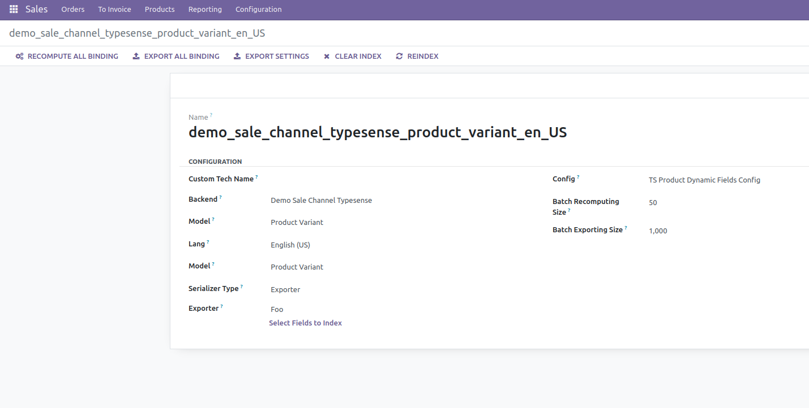
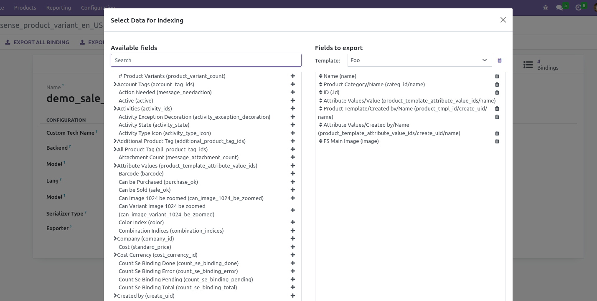
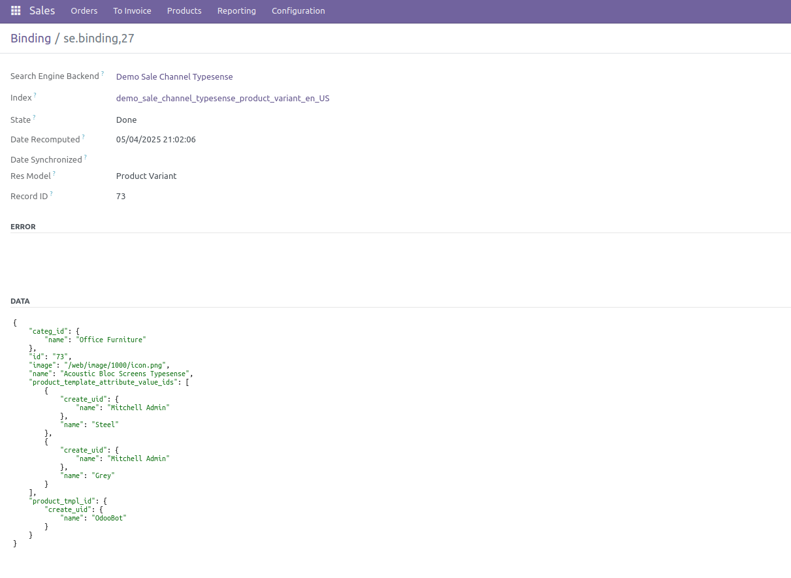

## Simple Quick User Friendly Usage

The key of the module is the user friendly usage of ir.exports to serialize data and
resolve it for JSON.

Behind the scene everything is managed to jsonify:

    - images bytes into string
    - images thumbnail into urls external or internal (any of them in sequence)
    - many2one relation into string
    - many2one inner fileds into object of key value pairs
    - many2many into list of inner strings or objects
    - intergers are indexed as integers
    - floats are indexed as floats
    - id is ESSENIALLY indexed as string and not as integer (typesene only)

If relational field has inner relational field and that also has inner relational field
or data, no worries everything is managed smoothly.

Selecting fields and relations and inner relations is friendly handled by the exporter
dialog.

You can remove or add fields as you wish, as indexing is updated, and if necessary
recreated.

(recreating a collection only if a data type changes from string into object or vice
versa, like having many2one relation and then having the same relation with inner fields
of it)

## Media

